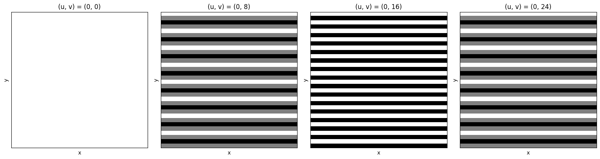

# SC4061 Computer Vision

## Topics

-   Imaging
-   Image Enhancement in Spatial Domain
-   Image Enhancement in Frequency Domain
-   Image Edge Processing

## Imaging

### Imaging Systems

-   Imaging is about capturing a scene's shape (geometry) and brightness (radiometry) to create a 2D representation
-   When a picutre is taken, 3D space turns into 2D space and results in a loss of depth information

#### Basic Components

-   Optical system: focuses light rays from a scene point to converge on one point (lens in camera or eye)
-   Screen: captures light via photoreceptors (retina in eyes, CCD/CMOS in cameras)
-   Aperture: controls light intake (pupil in eyes, adjustable in camera lens)

#### Human Visual System

-   Lens focuses light and is adjusted by muscles
-   Retina has rods for to percieve black/white and cones to perceive color, signals are sent via optic nerve to brain
-   Iris and pupil adjusts automatically, small in bright light and large in dark

#### Digital Cameras

-   Use lenses, sensors and apertures

### Geometric Image Formation

-   Light rays from objects pass through a lens to form an inverted image on the sensor plane

#### Thin Lens Model

-   Can be modelled by a simple thin lens
-   Thin lens has 2 spherical surfaces close to each other and is ideal for point-to-point imaging
    -   For an image to be ideal, it must map a point from object space to its corresponding point in image space
-   Unideal imaging is called abberation
-   Properties
    -   All rays entering lens parallel to optical axis will pass through the focal point on the opposite side (basic property)
    -   All rays entering lens through the focal point on its way to the lens will exit the lens parallel to the optical axis (symmetry property)
    -   All rays entering the lens center will pass straight through the lens, these rays are known as principal rays (consequent property)
-   Lens equations
    -   $\frac{1}{\hat{Z}} + \frac{1}{\hat{z}} = \frac{1}{f}$
        -   $\hat{Z}$ is the distance from object to lens
        -   $\hat{z}$ is the distance from lens to image
        -   $f$ is the focal distance of the lens
-   Magnification equations
    -   $\frac{X}{\hat{Z}} = \frac{x}{\hat{z}}$ and $\frac{Y}{\hat{Z}} = \frac{y}{\hat{z}}$
        -   (X, Y) are coordinates of a point in the object plane
        -   (x, y) are corresponding coordinates in the image plane

#### Depth of Field

-   Refers to the range of depths that scene objects can be at for acceptance imaging
-   Mainly affected by aperture
    -   Smaller aperture will result in larger depth of field
    -   Larger aperture will result in smaller depth of field

### Radiometric Image Formation

-   Deals with brightness/intensity
-   Full model involves light sources, object reflectance, lens collection and sensor response
-   A simplified model is $f(x, y) = i(x, y) \times r(x, y)$
    -   $f(x, y)$ is the image intensity
    -   $i(x, y)$ is the illumination function due to light sources
    -   $r(x, y)$ is the reflectance function due to object shape and albedo

### Digital Image Representation

#### Charge Coupled Device (CCD) Array

-   2D array of photo-diodes
-   Voltage at diodes proportional to image exposure
    -   Exposure = irradiance $\times$ time
    -   Time is the interval that the shutter is open
-   Color is being generated by the Bayer mosaic
    -   B, G, G, R layout
    -   Human eyes are more sensitive to green colour, hence 2 of them present
    -   4 units are then combined together to form 1 pixel in the final image

#### Spatial Sampling

-   Making it discrete
-   Smaller intervals result in higher pixel resolution

#### Quantization

-   Making it digital
-   For digital representation, diode voltages need to be quantized into discrete levels
-   In quantization, usually 8-bit encoding yields 256 levels (0–255), sufficient for human perception, as people cannot distinguish beyond this range
    -   More levels would mean greater dynamic resolution
-   An image is discrete after sampling, as it is broken into a grid of pixels
-   After quantization, where pixel values are converted to integers, the image is referred to as digital

#### Image as a Function or Matrix

-   For grayscale images, image intensity is often expressed as a scalar function $f(x, y)$
    -   Can also be viewed as a 2D matrix
-   For color images, it is a vector of three functions $r(x, y)$, $g(x, y)$, $b(x, y)$
    -   Can be viewed as 3D matrix

#### Image Filed Formats

-   GIF is a common 8-bit color indexing and lossless compression format used for web art
-   TIFF is traditionally used for scanned documents, may or may not be compressed
-   PNG is a newer lossless compressed format capable of handling 24-bit images
-   JPEG is a common lossy compression format based on Discrete Cosine Transform (DCT) capable of achieving high compression ratios
-   JPEG2000 is the latest lossy compression format based on Wavelet Transforms

## Image Enhancement in Spatial Domain

### Enhancing Images

-   Enhancement is done when one is not happy with how an image turns out
    -   Can be due to low constrast, noise, blurred, missing parts and more
-   Enhancement can be done using
    -   Point Processing
        -   Each pixel is modified independently based on only its own value
        -   Operations include adjustment of brightness, contrast and gamma correction
    -   Spatial Filtering
        -   Each pixel's new value depends on its neighbours as well as itself, using a mask that slides across an image
        -   Operations include blurring/smoothing, sharpening, edge detection and noise reduction

### Point Processing

-   Key idea: output pixel value = f(input pixel value)
-   $s = T(r)$
    -   $s$ is output pixel intensity
    -   $r$ is input pixel intensity
    -   $T$ is transformation function
-   Same function is applied to all pixels
-   Some functions may be dependent on global statistics

#### Contrast Stretching

-   Maps [r_min, r_max] to [0, 255]
-   Improves visibility under poor illumination
-   Typically involves using a smaller range as input to represent larger range as output

##### Power Law Transformations

-   Functions expressed as $s = c \cdot r^\gamma$
    -   $c$ and $\gamma$ are constants
-   When $\gamma < 1$, it brightens dark areas
    -   Used for MRI enhancement
-   When $\gamma > 1$, it darkens bright areas
    -   Used for aerial image enhancement

#### Histogram Equalization

-   Count how many pixels are there in the picture for each gray scale
-   Histogram reflects frequency (probability distribution)
-   Attempts to flatten the gray-level histogram through a gray-level transformation
    -   Order is preserved (dark stays darker)

### Spatial Filtering

-   Key idea: compute new pixel as weighted sum of neighbours

#### Correlation

-   Correlation uses the weights directly while convolution uses a flipped kernel
-   Formula: $g(x, y) = \sum_{s=-a}^{a} \sum_{t=-b}^{b} w(s, t) \cdot f(x+s, y+t)$

#### Averaging Filter

-   Also known as box filter
-   Replace each pixel's value with the average of its neighbours using a kernel
-   Reduces sharp intensity variations and often used to reduce noise
-   Steps
    -   Place kernel over the pixel
    -   Add up all pixel values inside the mask
    -   Divide by total number of pixels in the mask
    -   Assign average to the central pixel
-   Good at removing noise
-   Everything will be more or less the same, need to know the features before applying filter
-   Generally can help to smooth edges but results in loss of fine features
    -   If feature of interest is broad region or overall shape, averaging can help
    -   If feature of interest is edges, corners or fine detail, averaging is harmful

#### Gaussian Filter

-   Kernel values follow Gaussian distribution
-   Pixels closer to the center have higher weight and pixels further away have lower weight
-   Gives a gentler blur than Averaging Filter
-   Compute at discrete values for different size spatial filters
-   Normalize sum of coefficients to 1
-   Popular and often used

#### Median Filter

-   Non-linear filter
-   Used to remove impulse (salt and pepper or speckle) noise from an image
-   Effective in preserving edges
-   Steps
    -   For each pixel in the image, consider a small neighborhood centered around the pixel
    -   Sort all pixel values in that neighborhood
    -   Replace the center pixel value with the median value from the sorted list

#### Deep CNN and Convolution

-   Convolution is the key of image processing
-   Kernels are hard to design
    -   No effective way to do so
    -   No feedback
-   Inception of Deep CNN revolutionized machine learning by enabling kernels to be learned automatically from data, rather than being hand-engineered
-   Mathematically, convolution and correlation are not the same
    -   Convolution flips the kernel, while correlation does not
-   Most libraries implement cross-correlation where no flipping is done
    -   Computationally simpler
    -   Kernel weights are eventually to be learned, flipping is rendered useless

## Image Enhancement in Frequency Domain

### Fourier Transform

-   Fourier Transform is a mathematical tool used to transform an image from the spatial domain (where pixels are arranged in a grid of x, y coordinates) to the frequency domain
-   Image can be represented as a combination of different frequencies
    -   Low frequencies represent smooth, gradual changes in an image (uniform areas)
    -   High frequencies represent rapid changes (edges, textures, or noise)

```math
f(x, y) = F_0 \times a_0(x, y) + F_1 \times a_1(x, y) + F_2 \times a_2(x, y) + \dots + F_{n-1} \times a_{n-1}(x, y) = \sum_{i=0}^{n-1} F_i a_i(x, y)
```

```math
a_{(u,v)}(x, y) = \exp\left[j2\pi\left( \frac{xu}{M} + \frac{yv}{N}\right)\right] = \cos\left[2\pi \left( \frac{xu}{M} + \frac{yv}{N} \right)\right] + j \sin\left[2\pi \left( \frac{xu}{M} + \frac{yv}{N} \right)\right]
```

-   To transform an image from the spatial domain (pixels) to the frequency domain, apply Fourier Transform

```math
F(u, v) = \sum_{x=0}^{M-1} \sum_{y=0}^{N-1}
f(x, y) \,
\exp\!\left[
    -j 2 \pi \left( \frac{ux}{M} + \frac{vy}{N} \right)
\right]
```

-   Conversely, Inverse Fourier Transform is used to go from frequency domain to spatial domain

```math
f(x, y) = \frac{1}{MN}
\sum_{u=0}^{M-1} \sum_{v=0}^{N-1}
F(u, v) \,
\exp\!\left[
  j 2 \pi \left( \frac{ux}{M} + \frac{vy}{N} \right)
\right]
```

-   Simplify caluclations for things like waves and rotations by providing a way to handle oscillations

```math
j = \sqrt{-1}
```

### Fast Fourier Transform

-   Efficient algorithms for computing the Discrete Fourier transform (DFT)
-   Instead of performing convolution, we can use FT on each image and then multiply the 2 FTed imaages, reuslting in faster and more efficient compute
    -   Kernel used in convolution can be padded (usually zero padded) to the same size as the image for matmul to take place
-   `fftshift()` is used for convenience to shift origin from top left to center

### Convolution Theorem

-   Convolution of two spatial images is equivalent to multiplying the corresponding FTs
    -   Much lower computational cost

```math
g(x, y) = f(x, y) \otimes h(x, y) \\
\Updownarrow \\
G(x, y) = F(x, y) H(x, y)
```

```math
f(x, y) \otimes h(x, y) = \mathcal{F}^{-1} \big[ \mathcal{F}\{f(x, y)\} \cdot \mathcal{F}\{h(x, y)\} \big]
```

### Frequency and Spectrum

-   Periods can indexed by U and V
-   Decomposition is used to find out the amount that is required to be multiplied to a component
-   If $\frac{1}{MN}$ is not present after decomposing and synthesizing back, intensity will be $MN$ times larger — normalization ??? normalization
-   Synthesis is the process of performing IFT
-   Decomposition is the process of performing FT
-   Specturm is a plot of all $F(u,v)$
-   High frequency means more cycles and result in more "lines" appearing on the specturm
    -   Low frequency component reflect slow changing part, trend and overall information
    -   High frequency component reflect fast changing part, sudden change, jump and details
-   Low frequency would result in brighter spots in the spectrum
    -   Conversely for high frequency having darker spots
-   Usually images will have strong low frequency components

#### Worked Example

-   Sketch the real part of the basis function $a_{(u,v)}(x, y)$ for a 32x32 image ($M = N = 32$) with frequency pairs $(u, v) = (0, 0), (0, 8), (0, 16), (0, 24)$

-   Real part is:
    $$\cos\left[2\pi \left( \frac{xu}{M} + \frac{yv}{N} \right)\right]$$

-   Since $M = N = 32$ and $u = 0$, this simplifies to:
    $$\cos\left[2\pi \cdot \frac{y v}{32}\right] $$

-   This depends only on $y$ and $v$, producing horizontal stripes that vary along the $y$-direction, constant along $x$. The grid has $x, y = 0, 1, \dots, 31$.

-   For $(u, v) = (0, 0)$

    -   $$\cos\left[2\pi \cdot \frac{y \cdot 0}{32}\right] = \cos(0) = 1$$
    -   The real part is 1 across the entire 32x32 grid, representing a uniform (DC) component.

-   For $(u, v) = (0, 8)$

    -   $$\cos\left[2\pi \cdot \frac{y \cdot 8}{32}\right] = \cos\left[\frac{\pi y}{2}\right]$$
    -   The period is $y = 4$ (since $\frac{\pi y}{2} = 2\pi \implies y = 4$), giving 8 cycles over $y = 0$ to 31.
        -   $y = 0$: $\cos(0) = 1$
        -   $y = 1$: $\cos(\frac{\pi}{2}) = 0$
        -   $y = 2$: $\cos(\pi) = -1$
        -   $y = 3$: $\cos(\frac{3\pi}{2}) = 0$
        -   $y = 4$: $\cos(2\pi) = 1$
    -   Pattern: $[1, 0, -1, 0]$, repeating 8 times
    -   8 horizontal stripes, each 4 pixels tall, alternating bright (1), neutral (0), dark (-1), neutral (0)

-   For $(u, v) = (0, 16)$

    -   $$\cos\left[2\pi \cdot \frac{y \cdot 16}{32}\right] = \cos[\pi y]$$
    -   The period is $y = 2$ (since $\pi y = 2\pi \implies y = 2$), giving 16 cycles
        -   $y = 0$: $\cos(0) = 1$
        -   $y = 1$: $\cos(\pi) = -1$
        -   $y = 2$: $\cos(2\pi) = 1$
    -   Pattern: $[1, -1]$, repeating 16 times
    -   16 horizontal stripes, each 2 pixels tall, alternating bright (1) and dark (-1)

-   For $(u, v) = (0, 24)$

    -   $$\cos\left[2\pi \cdot \frac{y \cdot 24}{32}\right] = \cos\left[\frac{3\pi y}{4}\right]$$
    -   The period is $y = \frac{8}{3} \approx 2.667$ (since $\frac{3\pi y}{4} = 2\pi \implies y = \frac{8}{3}$), giving ~12 cycles
        -   $y = 0$: $\cos(0) = 1$
        -   $y = 1$: $\cos(\frac{3\pi}{4}) \approx -0.707$
        -   $y = 2$: $\cos(\frac{6\pi}{4}) = 0$
        -   $y = 3$: $\cos(\frac{9\pi}{4}) \approx 0.707$
        -   $y = 4$: $\cos(\frac{12\pi}{4}) = -1$
    -   Pattern repeats every 8 pixels
    -   ~12 horizontal stripes with smooth transitions (1, -0.707, 0, 0.707, -1, ...), period ~2.667 pixels


